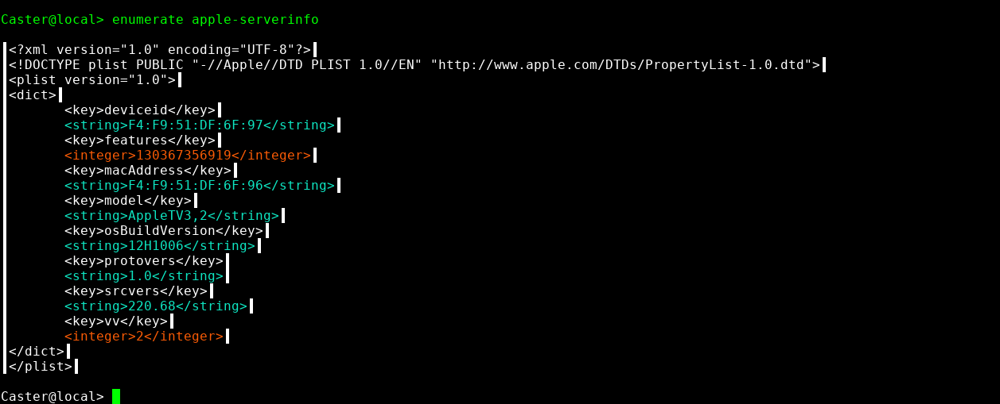
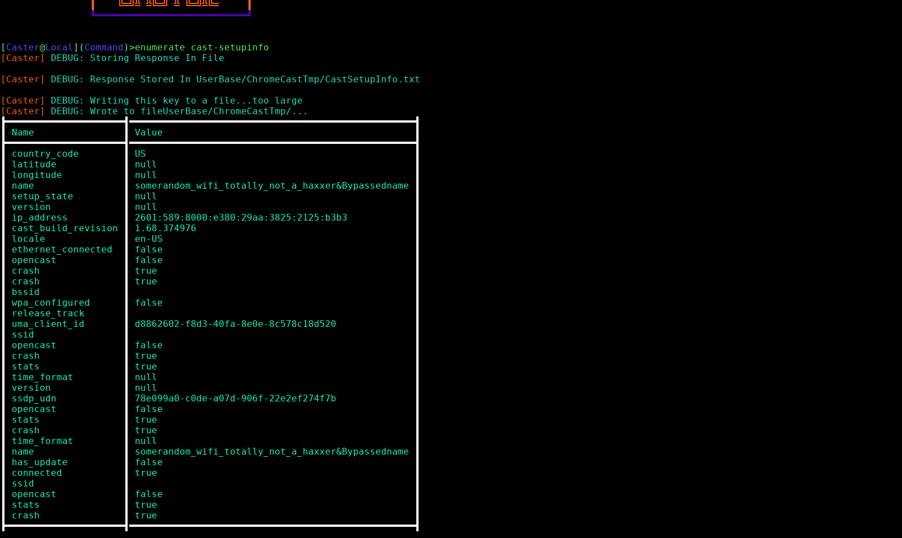
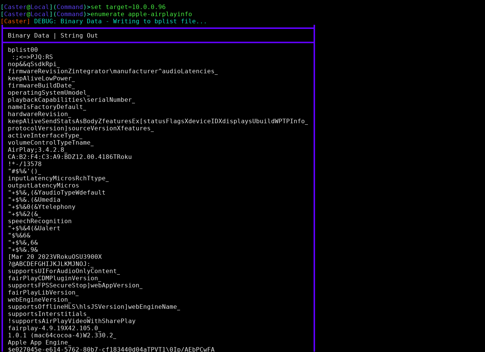
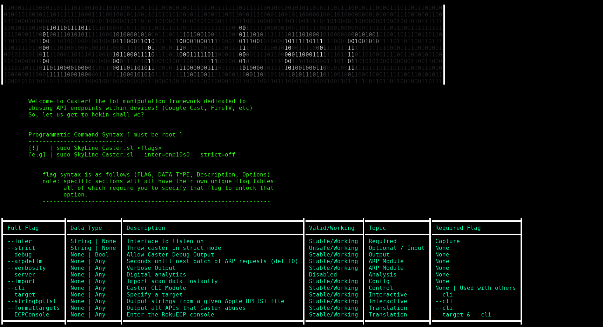

## Caster - IoT Manipulation Made Fun
Recently, the developers of SkyLine and @Totally_Not_A_Haxxer came together to build one of the very first technologies built using the SkyLine programming language! Caster, basically allows you to manipulate more than 1 smart TV and can span across devices from brands such as Amazon FireSticks, Apple TVs, Google Chromecasts, Roku TVs, and more!

## How To

For any information about this framework, please visit the following link

> **GitBook** - https://skypeguinsolutions.gitbook.io/skyline/skyline-experiments/introduction-to-module/caster-iot-manipulation-with-skyline

> **YouTube Demo Playlist | Caster** - https://www.youtube.com/watch?v=wcN6mh5SO8M&list=PLjdGpZIIr-0gtGn8ERB1V53pXGzg9QBy-

## Demonstrations

> Apple AirPlay Server Information

> Google ChromeCast Device Information

> Apple AirPlay RTSP Server Info

> Caster Help Screen

